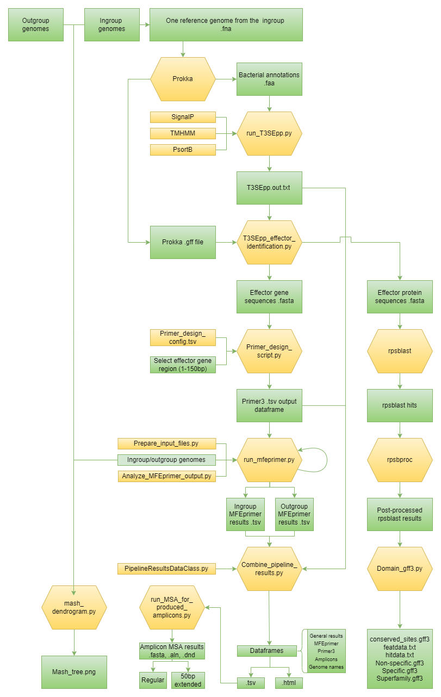

# P3-PRIEMA
P3-PRIEMA is an abbreviation for: "Pipeline Presenting Pathogen PRImers of Effectors in Molecular Assays". This pipeline finds specific primers targeting effector genes to differentiate between an ingroup and outgroup. For an in depth explanation about the pipeline, I refer to the methods section of the corresponding paper.
<br>
Figure 1 **A flowchart to illustrate the pipeline that finds specific primers targeting effector genes to differentiate between an ingroup and outgroup.** Yellow elements are either custom Python scripts or third-party software. Green elements represent input/output generated by the programs. 

# Set up
## Dependencies
### Mandatory
|                    Tool 	 |                Version 	 |                                                                                                                                                                                                                                                                                                                                                                                                                                                                                                                                                                                                                                                                                                    Citation 	 |  
|--------------------------:|-------------------------:|--------------------------------------------------------------------------------------------------------------------------------------------------------------------------------------------------------------------------------------------------------------------------------------------------------------------------------------------------------------------------------------------------------------------------------------------------------------------------------------------------------------------------------------------------------------------------------------------------------------------------------------------------------------------------------------------------------------:|
|                  T3SEpp 	 |                    1.0 	 |                                                                                                                                                                                                                                                                                                                                                                                                                                                                                                                                        Hui X, Chen Z, Lin M, et al. T3SEpp: an Integrated Prediction Pipeline for Bacterial Type III Secreted Effectors. mSystems. 2020;5(4). doi:10.1128/msystems.00288-20 	 |  	
| Conserved domain database | recommended: most recent |                                                                                                                                                                                                                                                                              <div class="csl-entry">Lu, S., Wang, J., Chitsaz, F., Derbyshire, M. K., Geer, R. C., Gonzales, N. R., Gwadz, M., Hurwitz, D. I., Marchler, G. H., Song, J. S., Thanki, N., Yamashita, R. A., Yang, M., Zhang, D., Zheng, C., Lanczycki, C. J., &#38; Marchler-Bauer, A. (2020). CDD/SPARCLE: The conserved domain database in 2020. <i>Nucleic Acids Research</i>, <i>48</i>(D1), D265–D268. https://doi.org/10.1093/nar/gkz991 |
|                 rpsbproc  |                    0.5.0 |                                                                                                                                                                                                                                                                                                                                                                                                                                      <div class="csl-entry">Yang, M., Derbyshire, M. K., Yamashita, R. A., &#38; Marchler-Bauer, A. (2020). NCBI’s Conserved Domain Database and Tools for Protein Domain Analysis. <i>Current Protocols in Bioinformatics</i>, <i>69</i>(1). https://doi.org/10.1002/cpbi.90 |
|               MFEprimer 	 |                  3.2.4 	 |                                                                                                                                                                                                                                                                                                                                                                                                                                                                                                                                                                   Wang K, Li H, Xu Y, et al. MFEprimer-3.0: Quality control for PCR primers. Nucleic Acids Res. 2019;47(W1):W610-W613. doi:10.1093/nar/gkz351 |
|                  ClustalW |                      2.1 |                                                                                                                                                                                                                                                                                                                                                                                Larkin, M. A., Blackshields, G., Brown, N. P., Chenna, R., Mcgettigan, P. A., McWilliam, H., Valentin, F., Wallace, I. M., Wilm, A., Lopez, R., Thompson, J. D., Gibson, T. J., & Higgins, D. G. (2007). Clustal W and Clustal X version 2.0. Bioinformatics, 23(21), 2947–2948. https://doi.org/10.1093/bioinformatics/btm404 |
| CheckM | 1.1.3 | Parks, D. H., Imelfort, M., Skennerton, C. T., Hugenholtz, P., &#38; Tyson, G. W. (2015). CheckM: Assessing the quality of microbial genomes recovered from isolates, single cells, and metagenomes. <i>Genome Research</i>, <i>25</i>(7), 1043–1055. https://doi.org/10.1101/gr.186072.114|

### Recommended
| Tool 	| Version 	 | Citation 	|  
|---:	|----------:|---:	|
| SignalP 	|     4.1 	 | Nielsen H. Predicting Secretory Proteins with SignalP. In: Kihara D. (Eds) Protein Function Prediction. Methods in Molecular Biology, Vol 1611. New York: Humana Press; 2017. doi:10.1007/978-1-4939-7015-5_6 	|  	
| TMHMM 	|    2.0c 	 | Krogh A, Larsson B, Von Heijne G, Sonnhammer ELL. Predicting transmembrane protein topology with a hidden Markov model: Application to complete genomes. J Mol Biol. 2001;305(3):567-580. doi:10.1006/jmbi.2000.4315   |
| PSORTb 	|     3.0 	 | Yu NY, Wagner JR, Laird MR, et al. PSORTb 3.0: Improved protein subcellular localization prediction with refined localization subcategories and predictive capabilities for all prokaryotes. Bioinformatics. 2010;26(13):1608-1615. doi:10.1093/bioinformatics/btq249   |

## Environments
The pipeline requires three environments that are provided by .yml files. An overview is given here about their contents.

### Prokka_env.yml
| Installation 	| Version 	| Citation 	|  
|---:	|---:	|---:	|
| Python	| 3.7.12	| Van Rossum, G., & Drake, F. L. (2009). Python 3 Reference Manual. Scotts Valley, CA: CreateSpace. 	|
| Prokka    | 1.14.6    | Seemann T. Prokka: Rapid prokaryotic genome annotation. Bioinformatics. 2014;30(14):2068-2069. doi:10.1093/bioinformatics/btu153 |

### T3SEpp_env.yml
| Installation 	| Version 	|                                                                                             Citation 	 |  
|---:	|---:	|-------------------------------------------------------------------------------------------------------:|
| Python 	| 3.6.10	|    Van Rossum, G., & Drake, F. L. (2009). Python 3 Reference Manual. Scotts Valley, CA: CreateSpace. 	 |
| Numpy 	| 1.13.3	|                                              Numpy. https://numpy.org/. Accessed September 21, 2021. 	 |
|  Pandas	| 0.25.3	|                                     Pandas. https://pandas.pydata.org/. Accessed September 21, 2021. 	 |
| Tensor 	| 1.3.0	|                                 Tensorflow. https://www.tensorflow.org/. Accessed September 21, 2021.	 |
|  Keras	| 2.1.2	|                                               Keras. https://keras.io/. Accessed September 21, 2021. 	 |
| hmmer 	| 3.1b2	|                                                HMMER. http://hmmer.org/. Accessed September 21, 2021.	 |
|  e1071	| 1.6.7	|        e1071. https://cran.r-project.org/web/packages/e1071/index.html. Accessed September 21, 2021. 	 |
|  Perl-io-string	| 1.08	|                    Perl-io-string. https://metacpan.org/dist/IO-String. Accessed September 21, 2021. 	 |
|  pftools	| 2.3.5	|                                     pftools. https://bio.tools/pftools. Accessed September 21, 2021. 	 |
|  Colorama	| 0.4.4	|                           colorama. https://pypi.org/project/colorama/. Accessed September 21, 2021. 	 |
| Beautiful Soup | 4.9.3 |Beautiful Soup. Retrieved January 17, 2022, from https://www.crummy.com/software/BeautifulSoup/bs4/doc/ |
| cssutils | 2.3.0 |                                                                                                                                                                                                                                                                                                                      cssutils. https://pypi.org/project/cssutils/. Accessed February 4, 2022. |


### rpsblast_env.yml
|        Installation 	 | Version 	 |Citation 	 |  
|----------------------:|----------:|---------------------------------:|
|              Python 	 |    3.7.8	 |Van Rossum, G., & Drake, F. L. (2009). Python 3 Reference Manual. Scotts Valley, CA: CreateSpace. 	 |
|                  CAP3 |   10.2011 |<div class="csl-entry">Huang, X., &#38; Madan, A. (1980). CAP3: A DNA Sequence Assembly Program Resource 868 Genome Research. In <i>Kececioglu and Myers</i>. www.genome.orgwww.genome.org |
|                  Spoa |     4.0.3 |<div class="csl-entry">Vaser, R., Sović, I., Nagarajan, N., &#38; Šikić, M. (2017). Fast and accurate de novo genome assembly from long uncorrected reads. <i>Genome Research</i>, <i>27</i>(5), 737–746. https://doi.org/10.1101/gr.214270.116< |
|                 ETE 3 |     3.1.2 |<div class="csl-entry">Huerta-Cepas, J., Serra, F., &#38; Bork, P. (2016). ETE 3: Reconstruction, Analysis, and Visualization of Phylogenomic Data. <i>Molecular Biology and Evolution</i>, <i>33</i>(6), 1635–1638. https://doi.org/10.1093/molbev/msw046 |
|                 pysam |  0.16.0.1 |<div class="csl-entry">Li, H., Handsaker, B., Wysoker, A., Fennell, T., Ruan, J., Homer, N., Marth, G., Abecasis, G., &#38; Durbin, R. (2009). The Sequence Alignment/Map format and SAMtools. <i>Bioinformatics</i>, <i>25</i>(16), 2078–2079. https://doi.org/10.1093/bioinformatics/btp352 |
|              samtools |      1.11 |<div class="csl-entry">Li, H., Handsaker, B., Wysoker, A., Fennell, T., Ruan, J., Homer, N., Marth, G., Abecasis, G., &#38; Durbin, R. (2009). The Sequence Alignment/Map format and SAMtools. <i>Bioinformatics</i>, <i>25</i>(16), 2078–2079. https://doi.org/10.1093/bioinformatics/btp352 |
|              bcftools |       1.8 |<div class="csl-entry">Li, H., Handsaker, B., Wysoker, A., Fennell, T., Ruan, J., Homer, N., Marth, G., Abecasis, G., &#38; Durbin, R. (2009). The Sequence Alignment/Map format and SAMtools. <i>Bioinformatics</i>, <i>25</i>(16), 2078–2079. https://doi.org/10.1093/bioinformatics/btp352 |
|                SeqKit |    0.14.0 |<div class="csl-entry">Shen, W., Le, S., Li, Y., &#38; Hu, F. (2016). SeqKit: A cross-platform and ultrafast toolkit for FASTA/Q file manipulation. <i>PLoS ONE</i>, <i>11</i>(10), 1–10. https://doi.org/10.1371/journal.pone.0163962 |
|              pyBigWig |    0.3.17 |<div class="csl-entry">Ramírez, F., Ryan, D. P., Grüning, B., Bhardwaj, V., Kilpert, F., Richter, A. S., Heyne, S., Dündar, F., &#38; Manke, T. (2016). deepTools2: a next generation web server for deep-sequencing data analysis. <i>Nucleic Acids Research</i>, <i>44</i>(W1), W160–W165. https://doi.org/10.1093/nar/gkw257 |
| ucsc-bedgraphtobigwig |       377 |<div class="csl-entry">Kent, W. J., Zweig, A. S., Barber, G., Hinrichs, A. S., &#38; Karolchik, D. (2010). BigWig and BigBed: Enabling browsing of large distributed datasets. <i>Bioinformatics</i>, <i>26</i>(17), 2204–2207. https://doi.org/10.1093/bioinformatics/btq351 |
|                 blast |    2.10.1 |<div class="csl-entry">Camacho, C., Coulouris, G., Avagyan, V., Ma, N., Papadopoulos, J., Bealer, K., &#38; Madden, T. L. (2009). BLAST+: Architecture and applications. <i>BMC Bioinformatics</i>, <i>10</i>. https://doi.org/10.1186/1471-2105-10-421 |
|               Numpy 	 |   1.13.3	 |Numpy. https://numpy.org/. Accessed September 21, 2021. 	 |
|           Biopython 	 |     1.78	 |Cock PJA, Antao T, Chang JT, et al. Biopython: Freely available Python tools for computational molecular biology and bioinformatics. Bioinformatics. 2009;25(11):1422-1423. doi:10.1093/bioinformatics/btp163	 |
|               Pandas	 |    1.1.3	 |Pandas. https://pandas.pydata.org/. Accessed September 21, 2021. 	 |
|              BEDTools |    2.29.2 |<div class="csl-entry">Quinlan, A. R., &#38; Hall, I. M. (2010). BEDTools: A flexible suite of utilities for comparing genomic features. <i>Bioinformatics</i>, <i>26</i>(6), 841–842. https://doi.org/10.1093/bioinformatics/btq033 |
|                 Racon |    1.4.13 |<div class="csl-entry">Vaser, R., Sović, I., Nagarajan, N., &#38; Šikić, M. (2017). Fast and accurate de novo genome assembly from long uncorrected reads. <i>Genome Research</i>, <i>27</i>(5), 737–746. https://doi.org/10.1101/gr.214270.116 |
|               minimap |       0.2 |<div class="csl-entry">Li, H. (2016). Minimap and miniasm: Fast mapping and de novo assembly for noisy long sequences. <i>Bioinformatics</i>, <i>32</i>(14), 2103–2110. https://doi.org/10.1093/bioinformatics/btw152 |
|              minimap2 |      2.17 |<div class="csl-entry">Li, H. (2018). Minimap2: Pairwise alignment for nucleotide sequences. <i>Bioinformatics</i>, <i>34</i>(18), 3094–3100. https://doi.org/10.1093/bioinformatics/bty191 |

### Effector_env.yml
| Installation 	| Version 	 |                                                                                                                                                                                                                                                                                                                                                                                    Citation 	 |  
|---:	|----------:|----------------------------------------------------------------------------------------------------------------------------------------------------------------------------------------------------------------------------------------------------------------------------------------------------------------------------------------------------------------------------------------------:|
| Python 	|   3.8.11	 |                                                                                                                                                                                                                                                                                          Van Rossum, G., & Drake, F. L. (2009). Python 3 Reference Manual. Scotts Valley, CA: CreateSpace.  	 |
| Colorama 	|    0.4.4	 |                                                                                                                                                                                                                                                                                                                   colorama. https://pypi.org/project/colorama/. Accessed September 21, 2021.	 |
| Biopython 	|     1.79	 |                                                                                                                                                                                Cock PJA, Antao T, Chang JT, et al. Biopython: Freely available Python tools for computational molecular biology and bioinformatics. Bioinformatics. 2009;25(11):1422-1423. doi:10.1093/bioinformatics/btp163	 |
|  BCBio-gff	|    0.6.6	 |                                                                                                                                                                                                                                                                                                                    BCBio. https://biopython.org/wiki/GFF_Parsing. Accessed October 7, 2021. 	 |
|  Jinja2	|   2.11.2	 |                                                                                                                                                                                                                                                                                                                    Jinja2. https://palletsprojects.com/p/jinja/. Accessed October 15, 2021. 	 |
|  Pandas	|    1.1.3	 |                                                                                                                                                                                                                                                                                                                            Pandas. https://pandas.pydata.org/. Accessed September 21, 2021. 	 |
| Matplotlib |     3.2.1 |                                                                                                                                                                                                                                                                                   Hunter JD. Matplotlib: A 2D graphics environment. Comput Sci Eng. 2007;9(3):90-95. doi:10.1109/MCSE.2007.55 |
| Scipy |     1.7.1 |                                                                                                                                                                                                               Virtanen P, Gommers R, Oliphant TE, et al. SciPy 1.0: Fundamental Algorithms for Scientific Computing in Python. Nat Methods. 2020;17(3):261-272. doi:10.1038/s41592-019-0686-2 |
| Mash |      1.14 | <ul><li>Ondov BD, Treangen TJ, Melsted P, et al. Mash: Fast genome and metagenome distance estimation using MinHash. Genome Biol. 2016;17(1):1-14. doi:10.1186/s13059-016-0997-x</li><li>Ondov BD, Starrett GJ, Sappington A, et al. Mash Screen: High-throughput sequence containment estimation for genome discovery. Genome Biol. 2019;20(1):1-13. doi:10.1186/s13059-019-1841-x</li></ul> | 
| Beautiful Soup |     4.9.3 |Beautiful Soup. Retrieved January 17, 2022, from https://www.crummy.com/software/BeautifulSoup/bs4/doc/ |
| cssutils |     2.3.0 |                                                                                                                                                                                                                                                                                                                      cssutils. https://pypi.org/project/cssutils/. Accessed February 4, 2022. |
| ETE 3 |     3.1.2 | ETE 3: Reconstruction, analysis and visualization of phylogenomic data. Jaime Huerta-Cepas, Francois Serra and Peer Bork. Mol Biol Evol 2016; doi: 10.1093/molbev/msw046 |
| scikit-bio |     0.5.6 | scikit-bio: A Bioinformatics Library for Data Scientists, Students, and Developers. http://scikit-bio.org. Accessed February 9, 2022. |
| hmmer 	|    3.3.2	 |                                                HMMER. http://hmmer.org/. Accessed September 21, 2021.	 |


## Installation
In order to run the pipeline, some necessary prerequisites need to be installed.
1. Clone the git repository.
2. Make sure that [Miniconda](https://docs.conda.io/en/latest/miniconda.html "Miniconda") and [pip](https://pip.pypa.io/en/stable/cli/pip_install/, "pip") is installed.
3. Set up a [Snakemake (v6.10.0) environment](https://snakemake.readthedocs.io/en/stable/index.html, "Snakemake installation"). 
4. [T3SEpp](http://www.szu-bioinf.org/T3SEpp/download.html "T3SEpp") need to be installed. Optionally but recommended, the following tools can be installed to enhance the performace of T3SEpp.
    1. [SignalP 4.1](https://services.healthtech.dtu.dk/service.php?SignalP-4.1, "SignalP"). 
    2. [TMHMM 2.0](https://services.healthtech.dtu.dk/service.php?TMHMM-2.0] "TMHMM"). 
    3. [PSORTb 3.0.3](https://www.psort.org/downloads/INSTALL.html "PSORTb").
5. Install [CheckM](https://ecogenomics.github.io/CheckM/, "CheckM").
6. Download the [conserved domain database](https://www.ncbi.nlm.nih.gov/cdd/ "CDD") (CDD).
7. Install [rpsbproc](https://ftp.ncbi.nlm.nih.gov/pub/mmdb/cdd/rpsbproc/ "rpsbproc").
8. Install [MFEprimer 3.2.3](https://www.mfeprimer.com/mfeprimer-3.1/ "MFEprimer").
9. Install [ClustalW 2.1](http://www.clustal.org/ "ClustalW")
10. Adjust the paths of config_snakefile.yaml. 
     1. Adjust the input genome at the top of the config file. Set the paths to the directories containing genomes of the ingroup and the outgroup. Finally, define the genus. The genus name will be used to store all indexed files produced by MFEprimer and zip the directory afterwards.
     2. Change the general settings. First, change the working directory. This is the path to the gitlab design_specific_effector_primers project. Second, the path to where the results need to be stored. Third, the path where the logs need to be stored.
     3. Specify the control by configuring the `config/Acat_control.fasta` file and setting the paths to the corresponding control genome(s) in the config snakefile.
     4. Make sure to adjust the file paths of the T3SEpp executable, the CheckM executable, the rpsbproc executable, the MFEprimer executable, the long-term storage location of MFEprimer files (database_save), the CDD (rpsblast_db), the cddid.tbl (cddid), the ClustalW executable and if installed, the executables of SignalP, TMHMM, PSORTb in config_snakefile.yaml.
     5. It is highly recommended to specify the path to save the database (database_save in the config file). Genomes will be indexed and can be saved. So, by rerunning the pipeline the genomes do not have to be indexed again. 
     6. Optionally, adjust the T3SEpp cut-off that determines the strictness of classifying a protein as effector.
     7. If you would like to find primers for a specific set of markers found by CheckM, adjust the marker_genes configuration.
     8. Naktuinbouw bioinformaticians have access to the file `data.tsv` that contains metadata for input genomes. This file can be added for a more understandable mash dendrogram.

# Run
If the config_snakefile.yaml file is correctly adjusted, the pipeline can be run using Snakemake. Activate the environment that contains Snakemake and use the following commands.
<br><br>
The in-house Snakemake environment.
```bash
conda activate /5_workspace/envs/snakemake_env/
```
Start the pipeline.
```bash
snakemake --snakefile design_specific_effector_primers/Snakefile.smk \
  --use-conda \
  --directory design_specific_effector_primers/ \
  --cores 12
```

Overwrite the input/output parameters using the following line of code.
```bash
snakemake --snakefile /5_workspace/repos/design_specific_effector_primers/Snakefile.smk --use-conda \
  --directory /5_workspace/repos/design_specific_effector_primers/ \
  --cores 12 \
  --config genome="[reference genome]" \
  genus="[genus]" \
  genomes_ingroup="[ingroup directory]" \
  genomes_outgroup="[outgroup directory]" \
  save_general_results="[output directory]" \
  log_file_output="[output directory]" \
  genome_metadata="[data.tsv]"
```

The command follows the [options](https://snakemake.readthedocs.io/en/stable/executing/cli.html "Snakemake options") given by Snakemake. It is recommended to define the directory where the necessary conda environments are stored by `--conda-prefix`.
<br>
<br>
The output for in-house users can be viewed using the following link. <br>
http://bga.naktuinbouw.cloud/PRIEMA_Output/

# Primer design
In the root directory of the repository, you can find the file Primer_design_config.tsv. This is the configuration for primer design by Primer3. Here you can modify setttings. Make sure that the format is still .tsv after modification.

# src
The src directory contains scripts to style the html output and make the tables more dynamically.

|         file 	 |                                                                                   purpose 	 | source/inspiration 	|
|---------------:|--------------------------------------------------------------------------------------------:|---:	|
|  main_menu.css |                                                                    Style the main menu page | [codepen.io Blue Squares](https://codepen.io/MichaelVanDenBerg/pen/aboqyOO) |
| table_sort.css | Change the cursor when hover over the table headers and add arrows in the sorting direction | [Codepen.io Sorting Tables with JavaScript](https://codepen.io/dcode-software/pen/zYGOrzK) |
|  table_sort.js |                    Sort the table by clicking on a column in ascending or descending order. | [Codepen.io Sorting Tables with JavaScript](https://codepen.io/dcode-software/pen/zYGOrzK) |

# Output
|                    Name	 | Type 	      | What 	                                                                                                                                                                                                                                                                                                                                                                                                                                                                                                                                                                                                                                                                                                                                                                                                                                          |
|-------------------------:|-------------|-------------------------------------------------------------------------------------------------------------------------------------------------------------------------------------------------------------------------------------------------------------------------------------------------------------------------------------------------------------------------------------------------------------------------------------------------------------------------------------------------------------------------------------------------------------------------------------------------------------------------------------------------------------------------------------------------------------------------------------------------------------------------------------------------------------------------------------------------|
|                 Prokka 	 | Directory 	 | Prokka output as listed in their [documentation](https://github.com/tseemann/prokka#output-files "Prokka output"). 	                                                                                                                                                                                                                                                                                                                                                                                                                                                                                                                                                                                                                                                                                                                            |
|             T3SEpp.out 	 | .txt 	      | Direct output from T3SEpp that classifies protein as type III effector or non-type III effector. 	                                                                                                                                                                                                                                                                                                                                                                                                                                                                                                                                                                                                                                                                                                                                              |
|         Effector_genes 	 | .fasta 	    | Proteins that are predicted as type III effector converted to a genomic sequence. 	                                                                                                                                                                                                                                                                                                                                                                                                                                                                                                                                                                                                                                                                                                                                                             |
| Effector_proteins                        | .fasta      | Proteins that are predicted as type III effector                                                                                                                                                                                                                                                                                                                                                                                                                                                                                                                                                                                                                                                                                                                                                                                                |
| rpsblast_effector_domain | Directory   | Directory containing information generated using rpsblast for domains within the effectors. <ul><li>conserved_sites.gff3: Individual conserved residues.</li><li>featdata.txt: Coordinates of the conserved residues.</li><li>hitdata.txt: Table containing data for all hits found by rpsblast.</li><li>Non-specific.gff3: Hits with an E-value higher than the threshold.</li><li>Specific.gff3: Hits with an E-value lower than the threshold.</li><li>Superfamily.gff3: The domain cluster to which the specific and/or non-specific hits belong.                                                                                                                                                                                                                                                                                           |
|                Primers 	 | .tsv 	      | Primers found by Primer3 that target the effector genes and the corresponding statistics listed in a .tsv files. 	                                                                                                                                                                                                                                                                                                                                                                                                                                                                                                                                                                                                                                                                                                                              |
|              MFEprimer 	 | Directory 	 | The directory contains subdirectories for every analysis of the primers against the ingroup/outgroup genomes. These subdirectories contain a .json file and stdout for every primer listed in Primers.tsv. In addition, a Traceback_dataframe is given that links the filename with the effector protein name given by Prokka. Two additional subdirectories are created: Ingroup_MFEprimer_dataframe_results and Outgroup_MFEprimer_dataframe_results. These directories contain summaries of all .json files generated by an ingroup or outgroup genome in .tsv format.                                                                                                                                                                                                                                                                       |
|         Pipeline_result	 | Directory 	 | This directory contains an overview of all results generated by T3sEpp, Primer3, and MFEprimer. Results are summarized in .tsv format and .html format. The .html files can be visualized by opening `Main_menu.html` in your browser. Data is represented as user-friendly as possible.                                                                                                                                                                                                                                                                                                                                                                                                                                                                                                                                                        |
|             Amplicon_MSA | Directory   | This directory contains multiple sequence alignment results generated using ClustalW for all amplicons predicted for every assay. We gave two MSA output directories. The regular directory contains MSAs for the amplicons. The extended directory contains MSA of the amplicons but with an additional 50bp downstream and upstream. Sequence IDs are in the following format:<br> [target/off(-target)].[in/out(group) - if it is an off-target].[assay index].[genome index].[off-target index]. Using these indices, you should be able to find the genome using the MSA.tsv file. <br><br>There are three types of files: <ul><li>.fasta: The amplicon DNA sequences</li><li>.aln: The alignment file, which can be viewed in your favorite tool. </li><li>.dnd: Neighbor-joining tree, which can be viewed in your favorite tree viewer. |
|                Mash tree | .png        | Figure showing a dendrogram to confirm the researcher's assumption of the ingroup and the outgroup.                                                                                                                                                                                                                                                                                                                                                                                                                                                                                                                                                                                                                                                                                                                                             |

# Protocols
The pipeline was tested <em>in vitro</em>. Necessary protocols are listed in the protocols directory.

# Validation
We added a directory with experimental validation data.
- pcr_qpcr_validation_data: Microsoft Excel file containing raw data of the designed qPCR assays (TR) and a general gram-negative assay as positive control (FAM). We interpreted the data as binary classification problem and presented this as input for confusion matrices for the conventional PCR assay and the developed qPCR assays.
- Ingroup-Outgroup_metadata: Additional information about the chosen isolates and columns telling whether the isolate was included in the PCR and/or qPCR validation experiments.
- Compute_qpcr_validation_figures: R Markdown script to compute figures for the validation experiments. 


# Filter using Marker genes.
Instead of finding primers for effector genes, we extended our horizon by adapting the pipeline and design primers onto marker genes. The T3SEpp element in the pipeline is exchanged for [CheckM](https://ecogenomics.github.io/CheckM/, "CheckM"). CheckM is generally a tool to assess genome quality by determining the presence of a set of marker genes. These genes are ubiquitous and single-copy within a phylogenetic lineage. Under the hood, CheckM annotates a genome. Using this output, we provide a set of marker genes to Primer3. It is for this extension that CheckM is also a mandatory installation.

## Run
```bash
snakemake --snakefile_markers /5_workspace/repos/design_specific_effector_primers/Snakefile.smk --use-conda \
  --directory /5_workspace/repos/design_specific_effector_primers/ \
  --cores 12 \
  --config genome="[reference genome]" \
  genus="[genus]" \
  genomes_ingroup="[ingroup directory]" \
  genomes_outgroup="[outgroup directory]" \
  save_general_results="[output directory]" \
  log_file_output="[output directory]" \
  genome_metadata="[data.tsv]" \
  marker_genes="1_50_marker_genes.fasta"
```


# FAQ
- **Q**: Why do I need to choose one ingroup genome as input? <br> **A**: Primers need to be designed given a certain input genome. The program will be very inefficient if primers are designed on a group of genomes.
- **Q**: Why does the program skip PSORTb? <br> **A**: PSORTb is third party software. Therefore, we are dependent on their software. There are situations in which PSORTb exits with a fatal error because it cannot call the method "next_hit". This leads to bad input for T3SEpp. We chose to skip the optional tool PSORTb if this warning occurs. Another explanation might be that there is still a PSORTb output file in the T3SEpp working directory.
- **Q**: It appears that the pipeline does not finish the T3SEpp step, why? <br> **A** It might be that PSORTb has a hard time analyzing the reference genome. The solution is to try another reference genome as input.
- **Q**: What is the significance of including the optional subcellular localization tools? <br> **A**: According to the [linear model](http://www.szu-bioinf.org/T3SEpp/modules.html, "Linear model T3SEpp") of T3SEpp, the weights of PSORTb, SignalP, and TMHMM are 0.06, 0.15, and 0.02 respectively. Meaning that when PSORTb gives the fatal error, described in the previous answer, the score differs 0.06 for effector proteins since the individual module score is either 1 (clue for a type III effector) or 0 (clue for a non-effector). In total, the score could decrease 0.23, meaning that the maximum score will lower to 0.77. In this case, it is recommended to lower the T3SEpp cut-off score to the default provided by T3SEpp itself of 0.5.
- **Q**: Why are there three conda environments rather than one? <br> **A**: Unfortunately, we were forced to make three environments because the third party software requires different Python versions.
- **Q**: Why do I need to both set the working directory on the command line and in the config_snakefile.yaml? <br> **A**: T3SEpp need to have the working directory set at the location of the T3SEpp executable. Therefore, we also need to define the working directory in the config_snakefile.yaml file to point back to run_T3SEpp.py.
- **Q**: Why is the genome name not included in the MSA output? <br> **A** The .aln file has a restricted number of characters for the ID. Therefore, we cannot include the genome name or file name, because some names are just too long.
- **Q**: Can I run the pipeline multiple times simultaneously? <br> **A** Yes, this is possible if the runs are from different genera. In the MFEprimer rule you zip and unzip the index files. If you try to access this directory for two runs it could break the pipeline.
- **Q**: Can I run the pipeline in a screen? <br> **A** This is perfectly fine. However, the dendrogram could show the following error: `qt.qpa.screen: QXcbConnection: Could not connect to display`. If this occurs. Do not run the mash rule in a screen but in the regular terminal. Kill the pipeline and run the same command in the screen. 

#
<p align="center">
  
</p>
